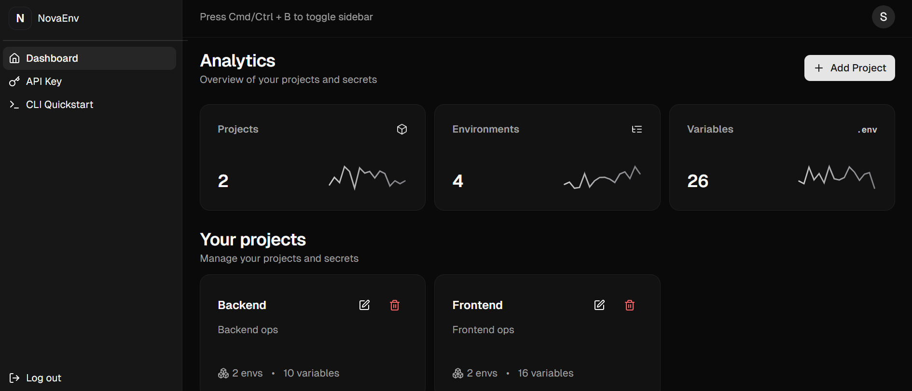
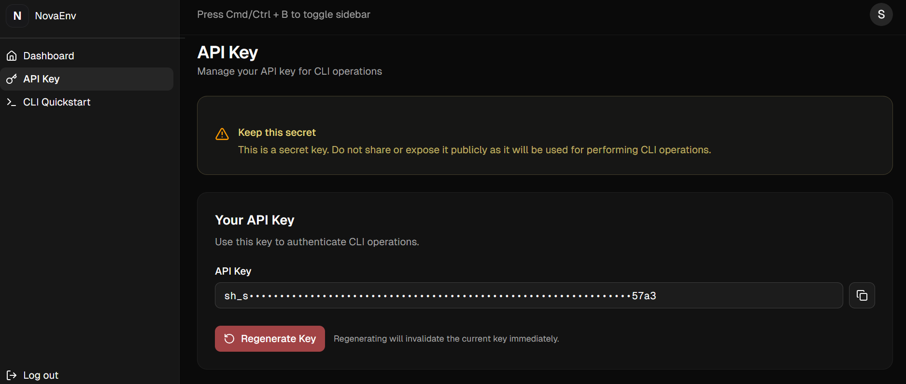
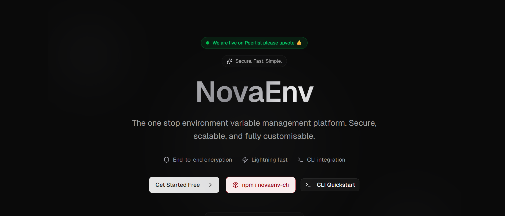

# NovaEnv CLI

Command-line interface for managing environment variables across your projects. Extract, sync, and deploy your environment configurations with ease.

**Web Dashboard:** https://novaenv.shobhnik.xyz

> **Note:** Project and environment creation is not supported via CLI. Please use the web dashboard to create projects and environments first, then use this CLI to extract and manage your variables.



## Installation

```bash
npm install -g novaenv-cli
```

## Commands

### `login`
Authenticate with your NovaEnv API key.

```bash
novaenv-cli login
```

Enter your API key when prompted from the dashboard.

---

### `projects`
List all projects, select environment, and extract variables to .env file.

```bash
novaenv-cli projects
```

Interactive selection of project → environment → .env creation.

---

### `whoami`
Show current logged in user information.

```bash
novaenv-cli whoami
```

Displays your API key and email.

---

### `logout`
Logout and clear stored credentials.

```bash
novaenv-cli logout
```

Removes stored API key and user data.

---

### `help`
Show help message with all available commands.

```bash
novaenv-cli help
```

Display usage instructions and command list.





## Support

For support and questions, contact us at: **shobhnikw@gmail.com**